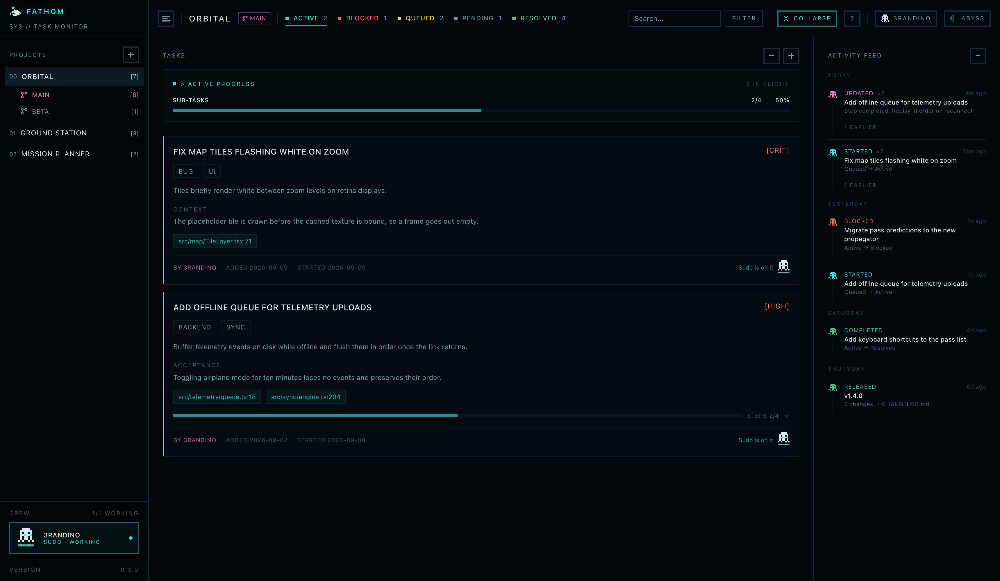
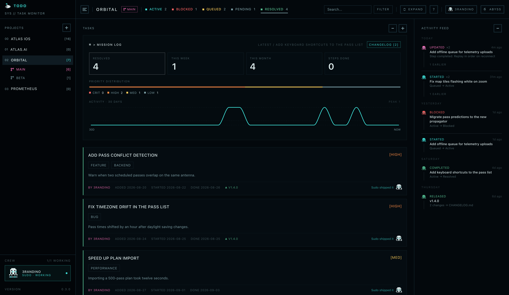
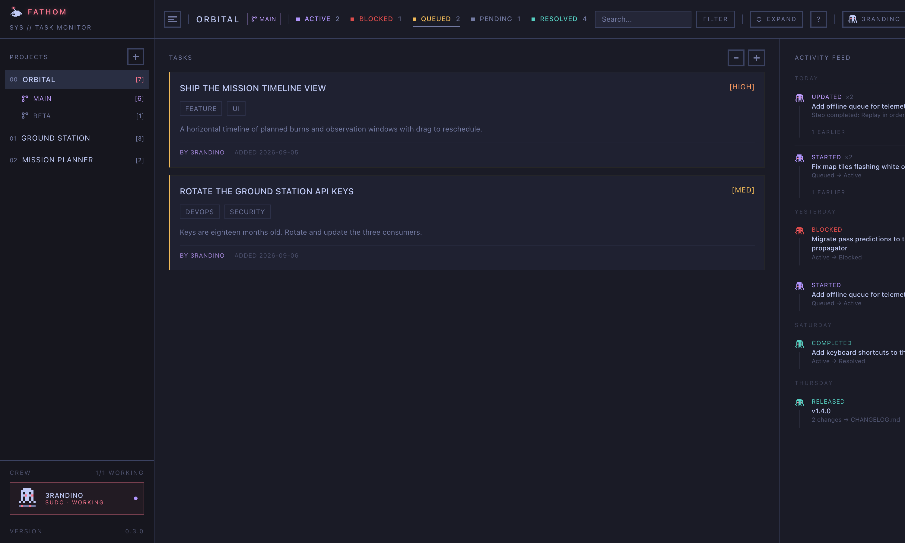
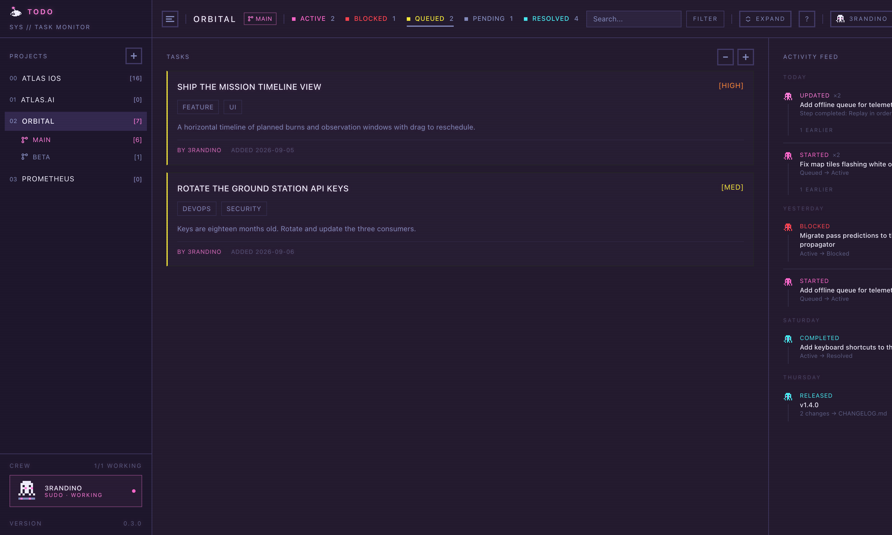
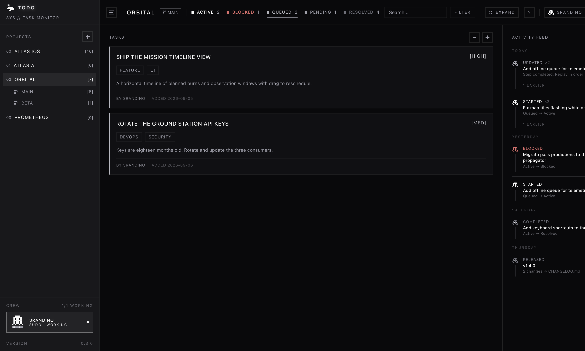
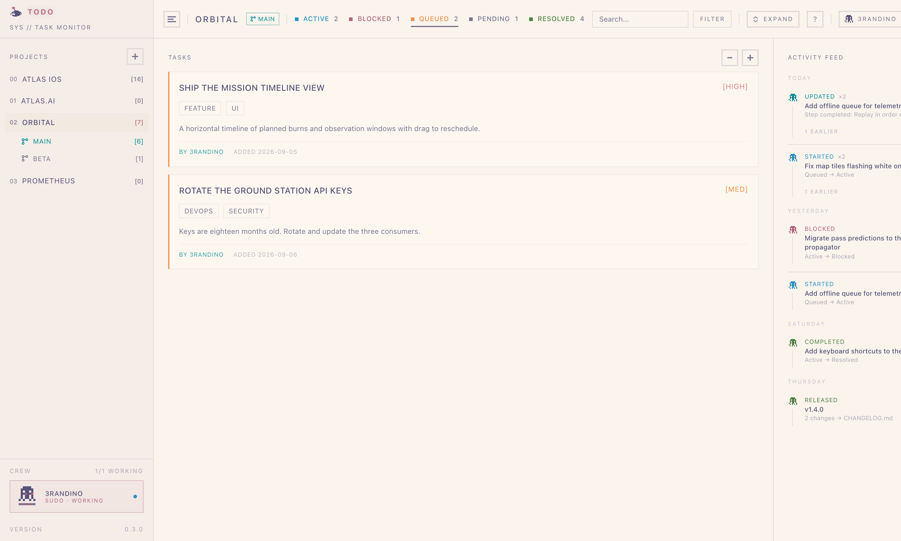
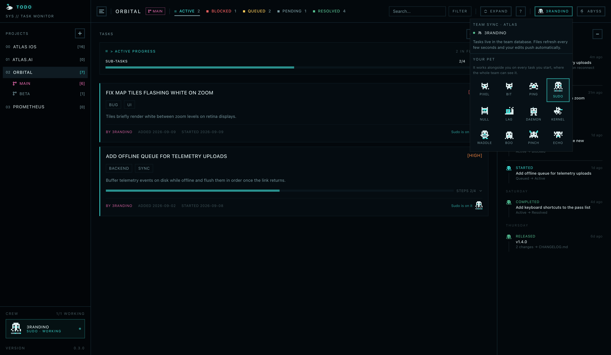

<p align="center"></p>

<h1 align="center">Fathom</h1>

<p align="center"><strong>Your agents keep the board. You read it.</strong></p>

Fathom is a skill for [Claude Code](https://docs.anthropic.com/en/docs/claude-code) and [Codex](https://developers.openai.com/codex/skills/) that turns either agent into a disciplined project manager, plus a local dashboard that shows every project on one board. Tasks live in plain markdown in your repo, or, for teams, in a shared database that keeps everyone's board in sync in real time.

## What it's actually like

The surprising part isn't the file format. It's that the agents *want* to use it.

Say "let's fix the flaky login test, add retries to the uploader, and get the release notes together." The agent doesn't just start typing. It opens three tasks, each with the files it plans to touch, the root cause it suspects, and the steps it intends to take. Then it works through them, ticking steps off as it finishes each one, and moves each task to Resolved with a note on what changed and a one-line changelog entry you could ship as is.

Tomorrow, in a fresh session, `/todo next` hands you the most important thing left with a briefing: what it is, the files involved, what's already done, what to look at first. The agent that wrote the task isn't the agent reading it, and it doesn't matter. Nor does it matter whether yesterday was Claude Code and today is Codex.

What that does to the way you work with an agent is the real feature. Talking to it turns into delegation. "Do this, this, and this" is enough, because the plan gets written down somewhere the agent is disciplined about, and progress gets checked back into the same place. You stop re-explaining context, and you stop losing half-finished work when a session dies.

A few things that fall out of it:

- **Bugs stop being one-liners.** The rules require file references and a root cause, so the agent goes and finds them before the task exists.
- **Multi-step work survives interruptions.** Steps live in the task. A session can end at step two and the next one starts at step three.
- **Release notes write themselves,** one sentence at a time, as work gets resolved. Cutting a release is one command.
- **The dashboard shows it all live,** every project on one board, with a team feed and, if you're into that sort of thing, pixel pets that sit on the tasks people are working on.
- **It works for a team the same way.** Point it at a Supabase project and it becomes a shared, real-time board, without changing how the skill works.

MIT licensed. No accounts, no servers, no database required until you want one.

<p align="center"></p>

---

## Quick Start

```bash
git clone https://github.com/Atlas-Fitness-AI/fathom.git
cd fathom
./install.sh
```

That installs the skill for both agents and the `fathom` command. Then, in any project:

```
/todo init
```

You get a `TODO.md`, a `TODORULES.md` with the rules and categories, and a TODO System section in `CLAUDE.md` and `AGENTS.md` so every future session knows the system exists. If you already have a `TODO.md`, `init` migrates it.

From there, just talk about work. The agent will start tracking it on its own.

---

## Commands

Examples use Claude Code's `/todo`. In Codex, use `$todo` with the same command and details.

```
/todo add Fix the login timeout        Claude Code
$todo add Fix the login timeout        Codex
```

| Command | What it does |
|---|---|
| `/todo` | Status overview |
| `/todo add [desc]` | Add a bug, feature, or task with enforced documentation |
| `/todo start [item]` | Start a task with a full briefing; steps auto-complete as the agent works |
| `/todo next` | Pick the highest-priority queued item, respecting dependencies and your branch |
| `/todo done [item]` | Resolve and archive a task, drafting a changelog line if it's user-visible |
| `/todo done step [text]` | Tick a step on the active task |
| `/todo move [item] [status]` | Move an item to any status |
| `/todo stuck [item]` | Mark as blocked with a reason |
| `/todo scan` | Find inline `TODO` and `FIXME` comments and sync them with the tracker |
| `/todo changelog` | Preview pending release notes |
| `/todo release [version]` | Write release notes to `CHANGELOG.md` and stamp the items |
| `/todo dashboard` | Launch the dashboard in your browser |
| `/todo init` | Set up a project, or migrate an existing `TODO.md` |
| `/todo update` | Refresh the rules template and audit existing items |
| `/todo help` | Quick reference |

---

## How It Works

### Every task is a record

```markdown
### Fix authentication timeout on refresh
- **Priority**: High
- **Category**: Backend, Auth
- **Author**: brandon
- **Files**: `src/auth/session.ts:42`, `src/middleware/refresh.ts:18`
- **Description**: Session refresh silently fails after 30 minutes, logging users out.
- **Context**: The token uses UTC while the server compares against local time.
- **Dependencies**: Migrate session store to Redis
- **Branch**: release-2.1
- **Steps**:
  - [x] Fix timezone comparison
  - [ ] Add refresh token rotation
  - [ ] Write integration tests
- **Added**: 2026-02-12
```

Bugs require files and context. Features require acceptance criteria. Tasks require a description of what and why. Resolving adds `Completed`, `Resolution`, and, for user-visible work, `Changelog`. Cutting a release adds `Released`. With team sync, `Author` is filled in automatically.

### Status flow

```
Pending ──▶ Queued ──▶ Active ──▶ Resolved
              ▲           │
              └─ Blocked ◀┘
```

| Status | Meaning |
|---|---|
| **Pending** | Identified, not fully defined yet |
| **Queued** | Ready to pick up |
| **Active** | Being worked on right now |
| **Blocked** | Stuck, with a reason |
| **Resolved** | Done and archived to `DONE.md` |

### Steps

Complex tasks get a checklist. The agent proposes steps during `add`, ticks them off as it finishes each one during `start`, and offers to resolve the task when the last one is done. The dashboard shows them as a progress bar with expandable mini-cards.

### Dependencies

A task can depend on other tasks. `start` warns if any are unresolved, and `next` prefers tasks whose dependencies are done.

### Branches

Tasks can carry a `Branch` field for work that targets a release branch alongside main. `next` prefers tasks matching your current git branch, `start` offers to check the right branch out, and the dashboard groups each project into a **main** directory plus one per branch. Everything else stays unscoped.

### Release notes

When you resolve something a user would notice, the agent drafts a one-sentence changelog line in plain language and shows it for you to adjust. `changelog` previews everything since the last release, grouped into **New** and **Fixed**. `release v1.2.0` writes that block to the top of `CHANGELOG.md` and stamps every resolved item. The dashboard offers the same flow from the Resolved tab.

### Code sync

`scan` searches the codebase for `// TODO:`, `# TODO:`, `<!-- TODO: -->`, and `// FIXME:` comments, offers to track the ones that aren't, and flags tracked ones that have disappeared.

---

## The Dashboard

```
/todo dashboard
```

That starts the dev server if needed, finds a free port, and opens your browser. Or run it yourself with `cd dashboard && bun install && bun dev`. It reads your task files straight from disk, so there's nothing to deploy.

**On the board**

- Every registered project in the sidebar, with a branch directory under each one
- Status tabs with counts, a hero panel with charts, and a Resolved view with throughput over time
- Search, and filters by priority and category
- An activity feed showing every add, start, step, block, and completion, attributed by person and agent
- Collapsible cards: a header toggle or the `c` key hides the long-form fields; click any card to open just that one
- Right-click a card to move it, change priority, or move it to another branch. Right-click a project to rename, remove, or open it in Finder or Terminal
- Add tasks and projects directly, with the same fields the skill enforces
- Release Notes dialog on the Resolved tab, with a Cut Release button

<p align="center"></p>

**Themes.** Ten of them: Light, Dark, Tokyo, CRT, Rosé, Synth, Ember, Dawn, Abyss, and Mono. Each has its own status and accent palette, not just a tint.

<table>
  <tr>
    <td></td>
    <td></td>
  </tr>
  <tr>
    <td></td>
    <td></td>
  </tr>
</table>

**Keyboard.** `1` to `5` switch tabs, `j` and `k` move between cards, `n` adds a task, `/` focuses search, `c` collapses cards, `?` opens help.

**Pets.** With team sync on, pick a pixel companion from the header menu: Pixel the cat, Bit the dog, Ping the frog, Sudo the octopus, Null the owl, Lag the snail, Daemon the robot, Kernel the dragon, Waddle the penguin, Boo the ghost, Pinch the crab, or Echo the bat. Your pet appears on every task you start, typing away where the whole team can see it, and stays on the ones you finish. The sidebar shows the crew: typing when someone is working, dozing at the keyboard when they have a task but haven't been seen for five minutes, and asleep when they have nothing active. Presence comes from a heartbeat that every skill command and open dashboard sends.

<p align="center"></p>

Projects are stored in `~/.fathom/config.json`. Add them from the sidebar or edit the file.

---

## Team Sync

By default everything is local. Add a Supabase project and the same tool becomes a shared, real-time board: every teammate sees the same tasks from Claude Code, Codex, or the dashboard, and edits appear everywhere within seconds.

**The skill doesn't change.** Task files stay on disk as caches of the database, and a `fathom sync` command keeps them in step. The skill runs it before reading and after every write; the dashboard runs it on its polling cycle. You keep editing markdown. Tasks gain a stable id (an invisible comment in the file) and an `Author`, and the activity feed becomes team-wide. Projects you haven't cloned still show up, materialized from the database.

Task files leave git in shared projects. `fathom sync` adds them to `.gitignore`, you untrack them once, and there are no more merge conflicts in `TODO.md`.

### Setup

One Supabase project equals one team. Everyone who signs in can read and write every task.

1. Create a free project at [supabase.com](https://supabase.com). On the create form, uncheck "Automatically expose new tables" and check "Enable automatic RLS".
2. Push the schema from this repo:

   ```bash
   brew install supabase/tap/supabase
   supabase login
   supabase link --project-ref <your-project-ref>
   supabase db push
   ```

3. Enable GitHub sign-in. Create a GitHub OAuth app (Settings → Developer settings → OAuth Apps) with callback URL `https://<your-project-ref>.supabase.co/auth/v1/callback`, then enable the GitHub provider in Supabase under Authentication → Sign In / Providers with the app's client ID and secret.
4. Under Authentication → URL Configuration, set the Site URL to `http://localhost:3000` and add `http://localhost:300*/**` to Redirect URLs.
5. **Lock down membership.** Under Authentication → Sign In / Providers, turn off "Allow new users to sign up." Otherwise anyone holding your URL and publishable key could join. Add teammates by inviting their email from the Users page before their first sign-in.
6. Add the project URL and publishable key to `~/.fathom/config.json` under a team name of your choosing:

   ```json
   {
     "projects": [...],
     "teams": {
       "atlas": {
         "url": "https://<your-project-ref>.supabase.co",
         "publishableKey": "sb_publishable_..."
       }
     }
   }
   ```

7. Sign in and import your projects:

   ```bash
   ~/.fathom/bin/fathom login
   ~/.fathom/bin/fathom sync --all
   ```

Each teammate repeats steps 6 and 7 with the same URL and key and their own GitHub account. Projects match across machines by their git `origin` remote. Add `~/.fathom/bin` to your `PATH` if you'd rather type `fathom`.

### Several teams

Each team is its own Supabase project, so being on two teams is two entries under `teams`, each set up the same way. Sign in to each with `fathom login <team>`. A project says which team it belongs to with `sync: <team>` in its `TODORULES.md`, and the sharing prompt asks which team when there's more than one. The dashboard shows one team at a time, with a switcher next to the Projects heading, and your local-only projects stay visible under every team. Pets and presence are per team, since profiles live in each team's database.

### Choosing what's shared

Nothing is shared without a decision. The first time sync would run for a project you're asked whether to share it or keep it local: during `init`, on the first command in an older project, in the terminal, or with a checkbox in the dashboard's add-project dialog. The answer is stored in the project's `TODORULES.md`, as a team name or `false`:

```yaml
archive: true
archive_file: DONE.md
sync: atlas
```

A project with no answer stays local. Change the value any time.

### The `fathom` command

```
fathom login [team]   sign in with GitHub, once per machine per team
fathom logout [team]  forget the stored session
fathom whoami         show who is signed in, per team
fathom sync [path]    push local edits, then regenerate the task files
fathom sync --all     sync every registered project
fathom sync --pull    regenerate only, discarding local edits
fathom sync --force   allow a push that deletes many tasks
```

Sync is careful by design. A fresh clone never deletes anything. An empty task file, or a push that would remove a large share of a project's tasks, needs `--force`. A file with no sync ids while the team already has tasks is treated as a stale copy from an old branch and regenerated rather than pushed. Concurrent edits to the same task resolve last-push-wins; edits to different tasks never conflict.

---

## Updating

```bash
cd fathom && git pull && ./install.sh
```

Then, in each project, `/todo update` refreshes `TODORULES.md` from the latest template while preserving your categories and settings, audits existing tasks for compatibility, and updates the guidance in `CLAUDE.md` and `AGENTS.md`.

---

## Customization

Edit `TODORULES.md` in your project to add categories, change the archive file, turn archiving off, or set the sharing decision. The skill reads it on every command.

---

## Development

```bash
cd dashboard && bun dev          # dashboard at localhost:3000
cd dashboard && bun run build    # production build and type check
bash tests/install.sh            # installer checks in a temp directory
```

The skill is `SKILL.md` plus `templates/`. After editing either, run `./install.sh` to sync both agents. The database schema lives in `supabase/migrations/`. Releases are listed in [CHANGELOG.md](CHANGELOG.md).

---

## License

[MIT](LICENSE) © Atlas Fitness AI, Inc. The `/todo` command name is deliberate: Fathom is the product, `todo` is what you type.
